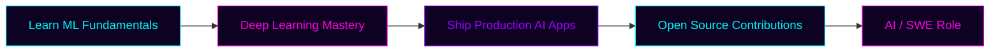

<div align="center">


<br/>


</div>

<br/>

<div align="center">

```
██████╗ ██████╗  ██████╗ ████████╗ ██████╗  ██████╗ ██████╗ ██╗
██╔══██╗██╔══██╗██╔═══██╗╚══██╔══╝██╔═══██╗██╔════╝██╔═══██╗██║
██████╔╝██████╔╝██║   ██║   ██║   ██║   ██║██║     ██║   ██║██║
██╔═══╝ ██╔══██╗██║   ██║   ██║   ██║   ██║██║     ██║   ██║██║
██║     ██║  ██║╚██████╔╝   ██║   ╚██████╔╝╚██████╗╚██████╔╝███████╗
╚═╝     ╚═╝  ╚═╝ ╚═════╝    ╚═╝    ╚═════╝  ╚═════╝ ╚═════╝ ╚══════╝

           > INITIALIZING PROFILE_MODULE::ANEES_MEMON
           > LOADING NEURAL_INTERESTS ... [ OK ]
           > MOUNTING TECH_STACK ......... [ OK ]
           > COMPILING PROJECTS ......... [ OK ]
           > STATUS: READY FOR COLLABORATION
```

</div>

<br/>

<table align="center" width="100%">
<tr>
<td width="100%" align="center">

## 🧬 `SYSTEM.PROFILE`

</td>
</tr>
</table>

<table align="center">
<tr>
<td width="55%" valign="top">

### 👤 About This Node

I'm a **Computer Science student** and **full-stack / AI engineer in training**, wiring together backend systems, machine learning models, and clean user interfaces. I like software that actually *does something useful* — not just demos.

My current orbit: **artificial intelligence**, **machine learning**, **backend engineering**, and **developer tooling** like Chrome extensions.

```yaml
identity:
  name: "Anees Memon"
  role: "Computer Science Student"
  archetype: "AI Enthusiast · Full-Stack Developer"
  location: "Sindh, Pakistan"
  mission: "Build. Learn. Improve. Repeat."
  status: "Actively shipping side projects"

current_objectives:
  - train_and_ship: "production-ready AI applications"
  - contribute_to: "open source"
  - master: "deep learning + system design"
  - target: "AI / Software Engineering role"
```

</td>
<td width="45%" valign="top" align="center">


<br/><br/>


<br/>


</td>
</tr>
</table>

<br/>

<table align="center" width="100%">
<tr>
<td width="100%" align="center">

## ⚙️ `TECH_STACK.INIT()`

*Languages, frameworks, and tools currently loaded into memory*

</td>
</tr>
</table>

<div align="center">

**Languages**


**Web & Frontend**


**Backend & Data**


**Tooling**


</div>

<br/>

<div align="center">


</div>

<br/>

<table align="center" width="100%">
<tr>
<td width="100%" align="center">

## 🚀 `PROJECTS.DEPLOY()`

*Selected builds from the local repository*

</td>
</tr>
</table>

<br/>

<table width="100%">
<tr>
<td width="50%" valign="top">

<div align="center">

### 🧩 EXTRACTLY
<sub>`CHROME_EXTENSION` · `OCR_ENGINE`</sub>

</div>

> A Chrome extension that pulls text straight out of screenshots using OCR — paste an image, get editable text back in seconds.

**Core Capabilities**
| Module | Function |
|---|---|
| 🔎 OCR Engine | Tesseract-powered text extraction |
| 📋 Clipboard | One-click copy of extracted text |
| 🖱️ Drag & Drop | Instant image ingestion |
| 💾 Export | Copy or download extracted content |

`Stack:`   

<div align="center">

[](https://github.com/Anees-Memon-Hub/Extractly)

</div>

</td>
<td width="50%" valign="top">

<div align="center">

### 💬 CHATTERBOX
<sub>`REAL_TIME_CHAT` · `FULLSTACK`</sub>

</div>

> A real-time chat platform built on FastAPI and MongoDB, with live messaging and secure auth baked in from the start.

**Core Capabilities**
| Module | Function |
|---|---|
| 🔐 Auth | JWT-based authentication |
| ⚡ Realtime | Socket.IO powered messaging |
| 👥 Groups | Multi-user group chats |
| 🎨 Interface | Clean, modern chat UI |

`Stack:`   

<div align="center">

[](https://github.com/Anees-Memon-Hub/ChatterBox)

</div>

</td>
</tr>
</table>

<br/>

<table width="100%">
<tr>
<td width="100%" valign="top">

<div align="center">

### 🧠 PERSONALITY ANALYSIS ENGINE
<sub>`MACHINE_LEARNING` · `NLP`</sub>

</div>

> A machine learning application that predicts emotion and personality traits from text input, using classic NLP techniques wrapped in an interactive Streamlit interface.

<table width="100%">
<tr>
<td width="50%" valign="top">

**Core Capabilities**
| Module | Function |
|---|---|
| 📊 Vectorization | TF-IDF feature extraction |
| 🤖 Model | Logistic Regression classifier |
| 🧪 Framework | Scikit-learn pipeline |
| 🖥️ Interface | Interactive Streamlit app |

</td>
<td width="50%" valign="top">

`Stack:` <br/>


<br/><br/>

[](https://github.com/Anees-Memon-Hub/personality-analysis-engine)

</td>
</tr>
</table>

</td>
</tr>
</table>

<br/>

<table align="center" width="100%">
<tr>
<td width="100%" align="center">

## 📡 `LEARNING.SYNC()`

*Skills currently being trained*

</td>
</tr>
</table>

<div align="center">

| Skill | Progress | Level |
|:---|:---|:---:|
| 🤖 Machine Learning | ████████████████░░ | `85%` |
| 🏗️ Backend Development | ███████████████░░░ | `80%` |
| ⚛️ React | █████████████░░░░░ | `75%` |
| 🧠 Deep Learning | ██████████░░░░░░░░ | `60%` |
| 🧩 System Design | █████████░░░░░░░░░ | `55%` |

</div>

<br/>

<div align="center">


</div>

<br/>

<table align="center" width="100%">
<tr>
<td width="100%" align="center">

## 🛰️ `ACTIVITY.FEED()`

</td>
</tr>
</table>

<p align="center">

</p>

<br/>

<table align="center" width="100%">
<tr>
<td width="100%" align="center">

## 🗺️ `ROADMAP.PLAN()`

</td>
</tr>
</table>

<div align="center">



</div>

<br/>

<table align="center" width="100%">
<tr>
<td width="100%" align="center">

## 🎯 `GOALS.EXECUTE()`

</td>
</tr>
</table>

<div align="center">

- 🧠 Build production-ready AI applications
- 🌐 Contribute meaningfully to open source
- 📚 Master advanced deep learning concepts
- 🛠️ Create software used by thousands of people
- 💼 Earn a role as an AI / Software Engineer

</div>

<br/>

<table align="center" width="100%">
<tr>
<td width="100%" align="center">

## ☕ `IDLE.PROCESS()`

*What runs in the background when I'm not coding*

</td>
</tr>
</table>

<div align="center">

| | |
|:---:|:---|
| 🤖 | Reading about new AI research and model releases |
| 📖 | Tech blogs and open-source deep-dives |
| ♟️ | Chess and logic puzzles |
| 🎮 | Gaming in downtime |
| ☕ | Coffee-fueled late-night coding sessions |
| 🎧 | Music while debugging |

</div>

<br/>

<table align="center" width="100%">
<tr>
<td width="100%" align="center">

## 📊 `NODE.STATS()`

</td>
</tr>
</table>

<div align="center">

| Metric | Value |
|:---|:---:|
| 🧑‍💻 Primary Focus | AI / ML / Backend Engineering |
| 🏗️ Currently Building | Full-stack AI-integrated applications |
| 🌱 Open To | Collaboration, open-source, internships |
| 💬 Ask Me About | Python, ML pipelines, FastAPI, Chrome extensions |
| ⚡ Fun Fact | I debug better with lo-fi playing in the background |

</div>

<br/>

<table align="center" width="100%">
<tr>
<td width="100%" align="center">

## 🔗 `CONNECT.ESTABLISH()`

</td>
</tr>
</table>

<div align="center">

<a href="https://github.com/Anees-Memon-Hub">

</a>
<a href="mailto:memonanees277@gmail.com">

</a>

</div>

<br/>

<div align="center">

```
> CONNECTION ESTABLISHED
> THANK YOU FOR VISITING THIS NODE
> "Great software is built one commit at a time."
> END OF TRANSMISSION_
```

⭐ **If this profile resonated with you, consider starring one of the repos above.**

</div>


